##Binary Patina II scene sketch

Abstract, Generative, FFT, LiveCam, Glitch Effect, Visual Performance     

All Source Code : oF 0.9, Xcode 7.1, osx 10.11 (Mac)

####Main Code : 
[https://github.com/jeonghopark/BinaryPatinaII](https://github.com/jeonghopark/BinaryPatinaII)

#### default callibration setting
[https://github.com/jeonghopark/BPII_Calibration](https://github.com/jeonghopark/BPII_Calibration)

###1. Winter - winterGrunge
sourceCode : [https://github.com/jeonghopark/GlungeWinter](https://github.com/jeonghopark/GlungeWinter)    

 Grunge-Frame, Abstract-Lines, Abstract-Shapes    
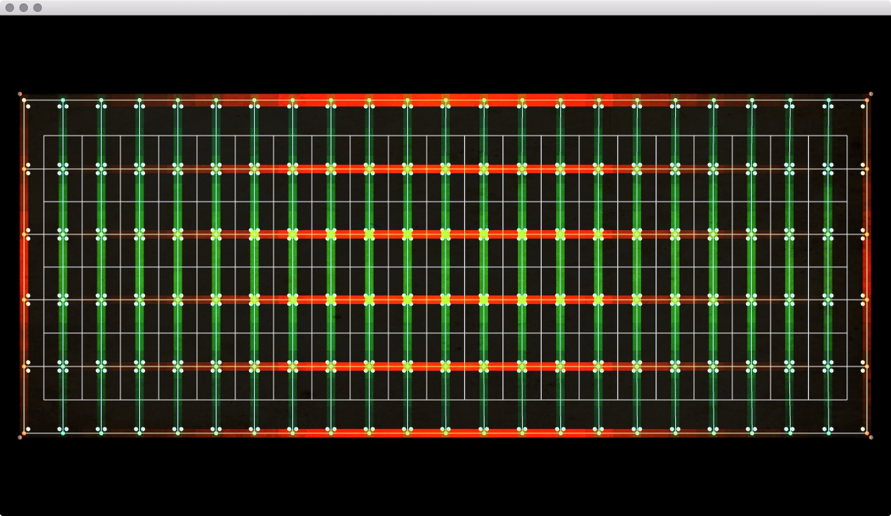     
 

###2. shell beach - live glitch
sourceCode : [https://github.com/jeonghopark/LiveCamGlitch](https://github.com/jeonghopark/LiveCamGlitch)    

 LiveCam, GlitchEffect    
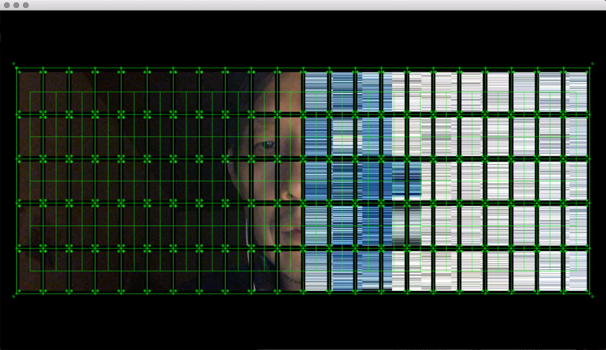     
 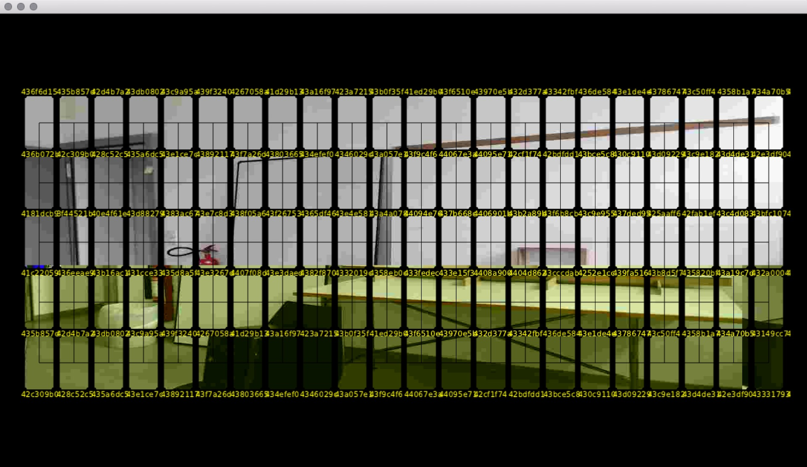     
 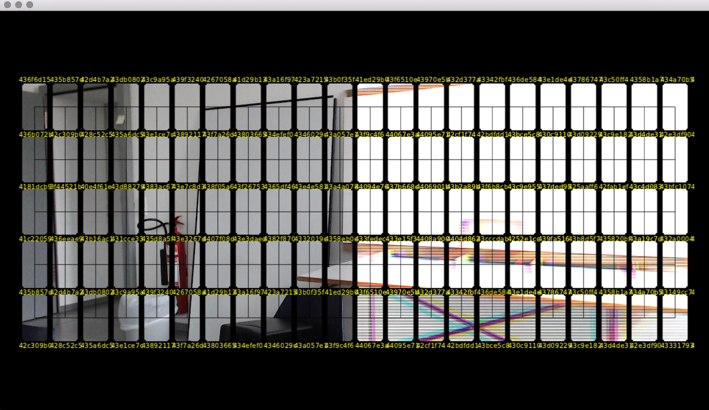     

 

###3. Thingy - labyrinth
sourceCode : [https://github.com/jeonghopark/Labyrinth](https://github.com/jeonghopark/Labyrinth)    

Particles, Abstract-Lines    
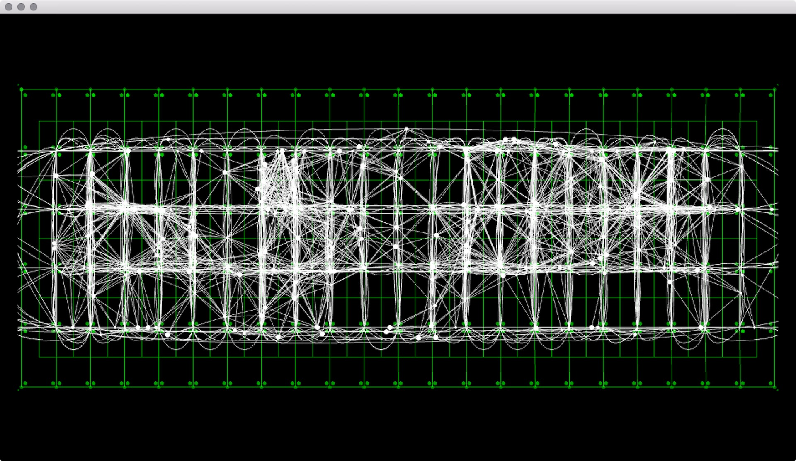     
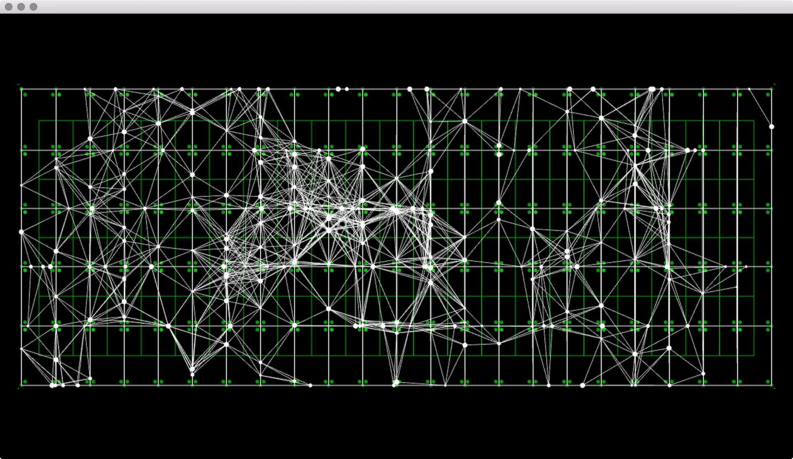     
 

###4. New Dub - fffshape
sourceCode : [https://github.com/jeonghopark/FFTShape](https://github.com/jeonghopark/FFTShape)    

FFT-Shape, Frame    
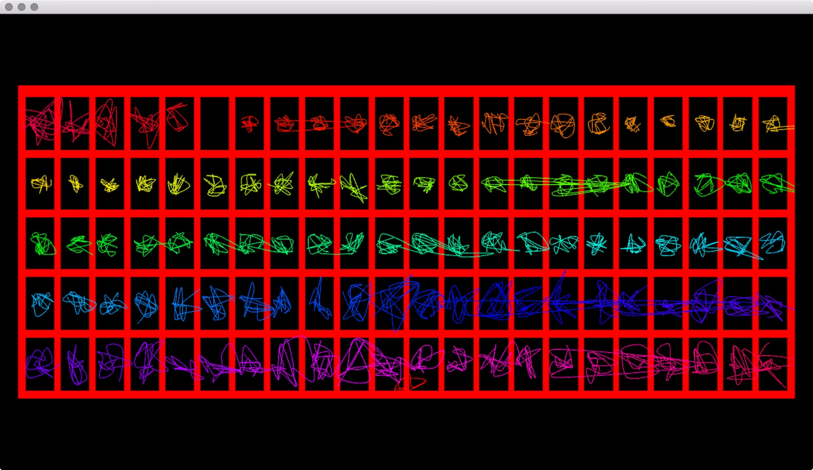     
 
 

###5. Fiona - pluto
Pluto-moon-earth--...
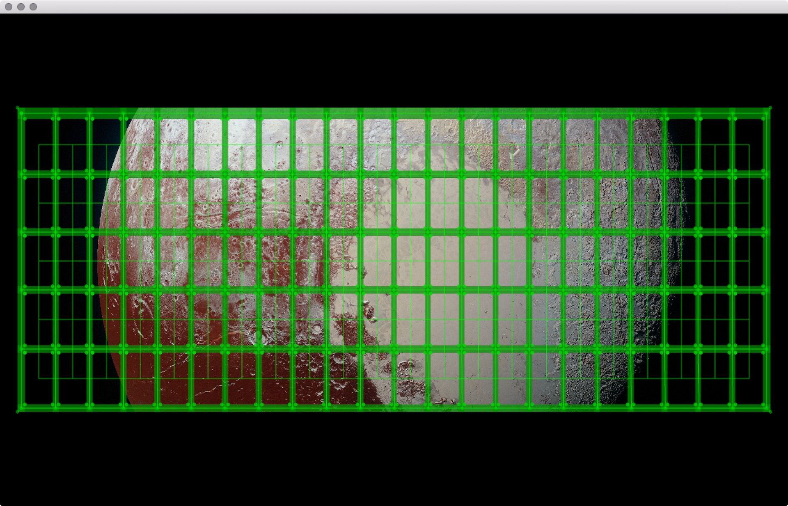     
 

###6. India - india
Abstract-Lines
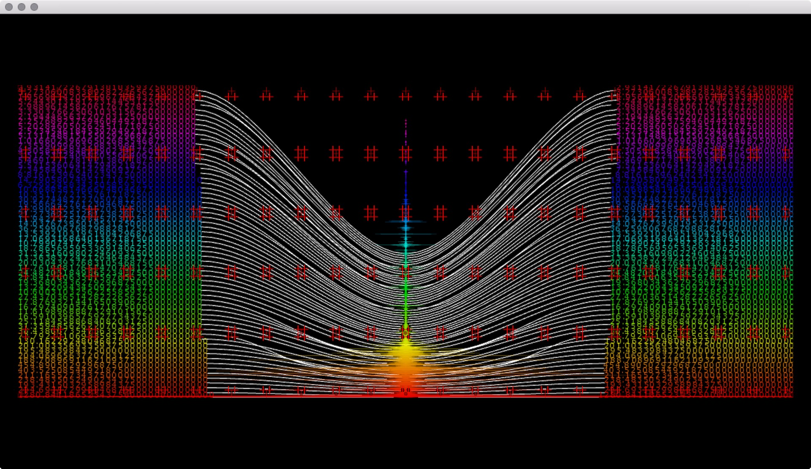     
 

###7. midnight run - Trier Flying Cam
sourceCode : [https://github.com/jeonghopark/OSMJsonMapFlying](https://github.com/jeonghopark/OSMJsonMapFlying)     

Trier Map, Map, Flying Cam.    
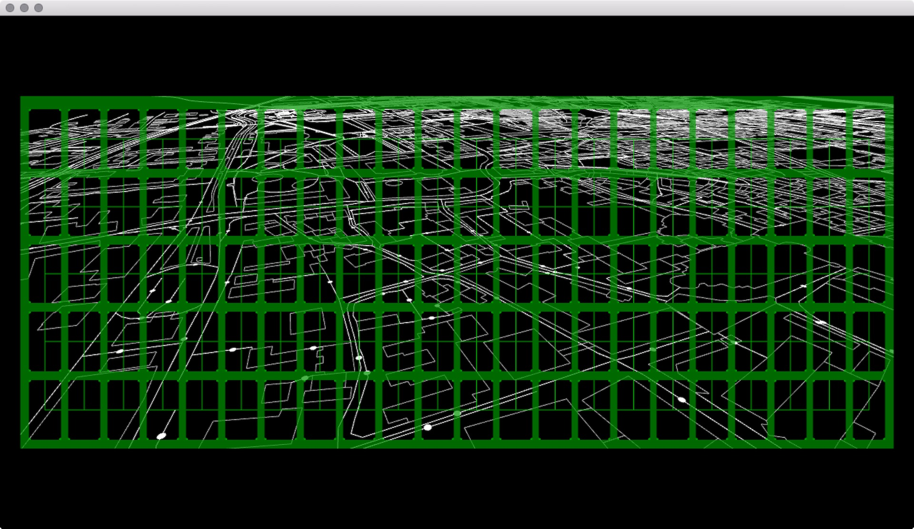     
 

###8. glasscherben - CubicMapFlying
sourceCode : [https://github.com/jeonghopark/CubicMapFlying](https://github.com/jeonghopark/CubicMapFlying)    

CubicMap, FlyingCam, Particles    
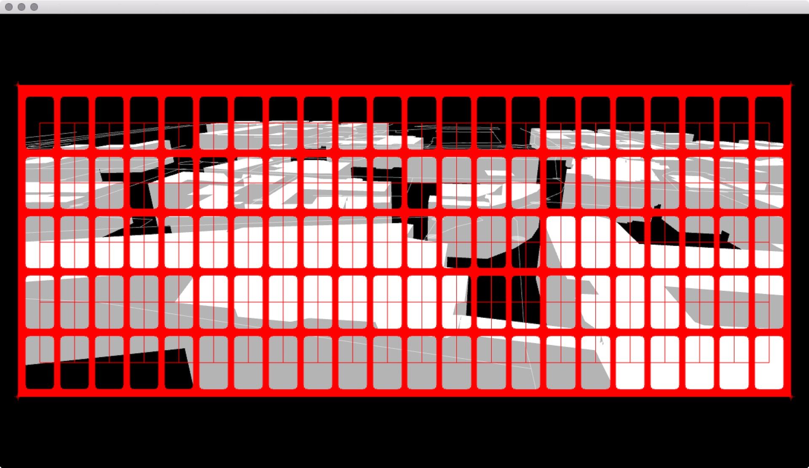     
 

###9. Stringer - moonCreator
Abstract-Sphere 
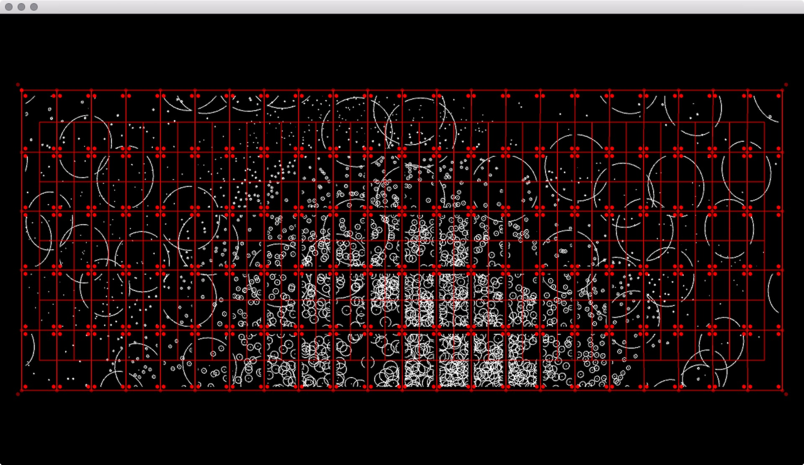     
 

###10. Blowfiles - LiveVideo
LiveCam, Abstract-Lines
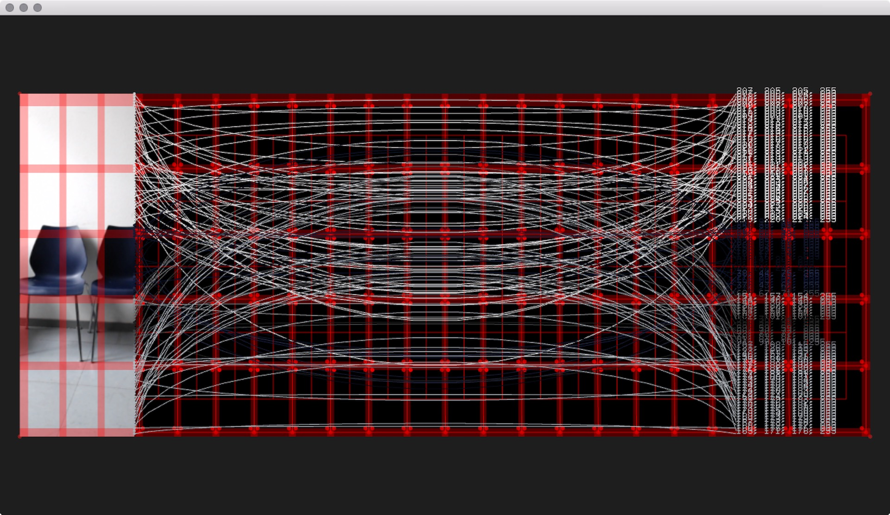     
 

###11.  GranuDub - movingFrame
Moving Text, Particles, Abstract-Lines
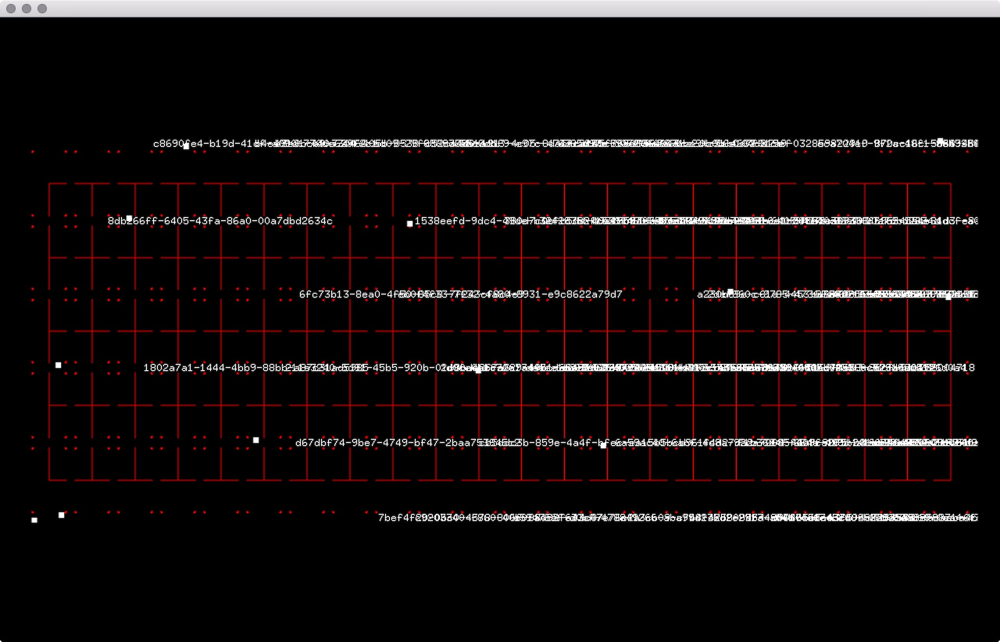     
 
 

###12. Patina - drone
sourceCode : [https://github.com/jeonghopark/DronAttack](https://github.com/jeonghopark/DronAttack)    

Drone Data, Map
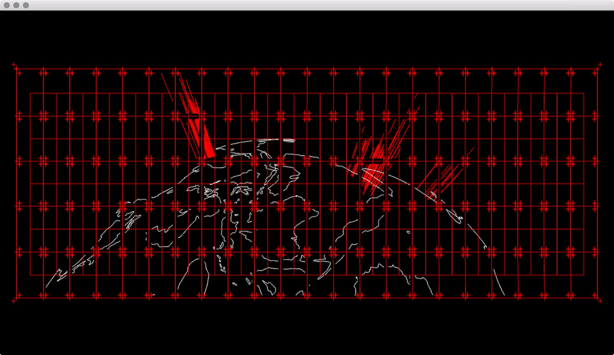     
 
 

###13. Oddity - liveCam
Web Cam Video, Video
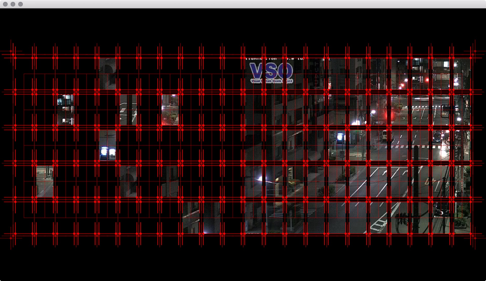     
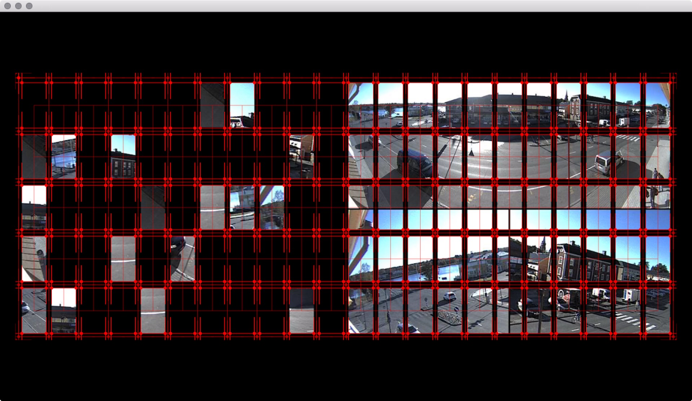     

###kinectNightVision.jpg
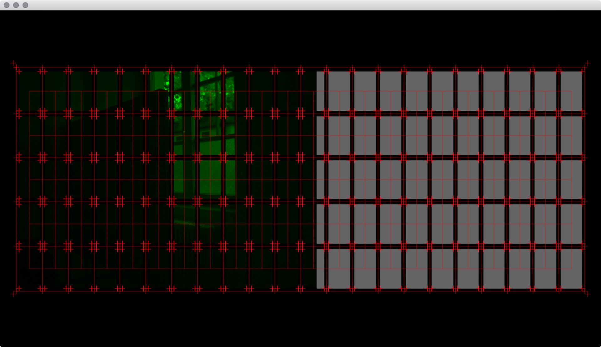

